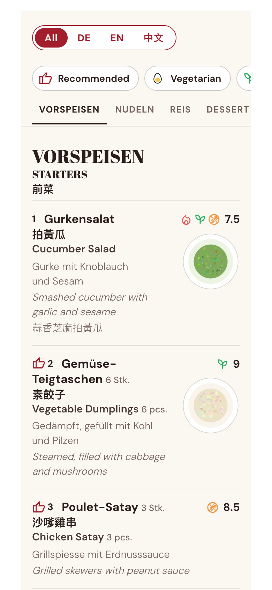
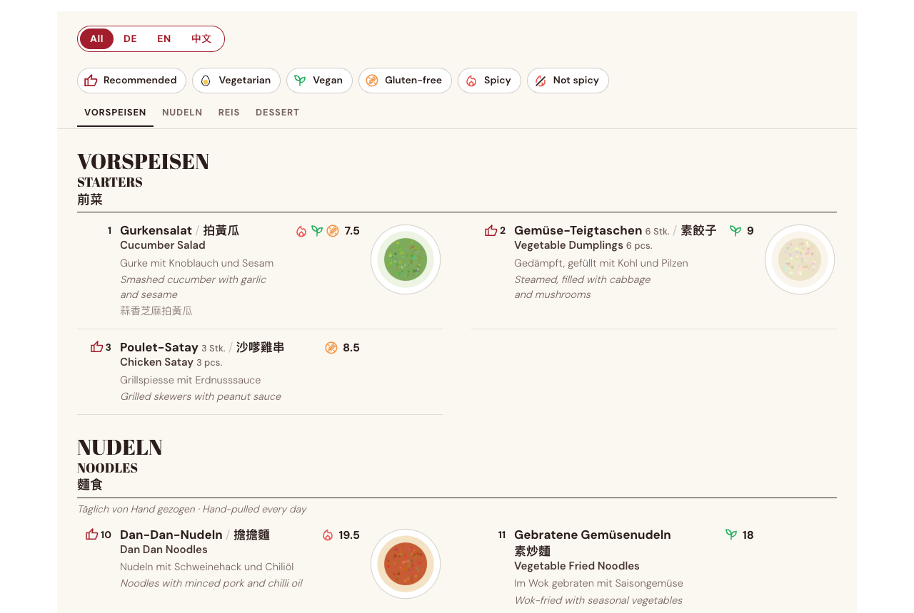
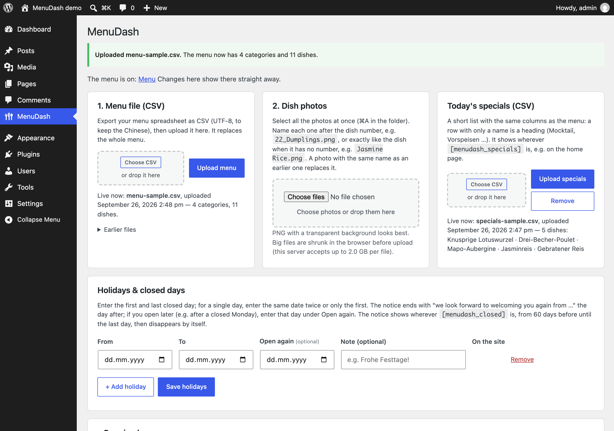
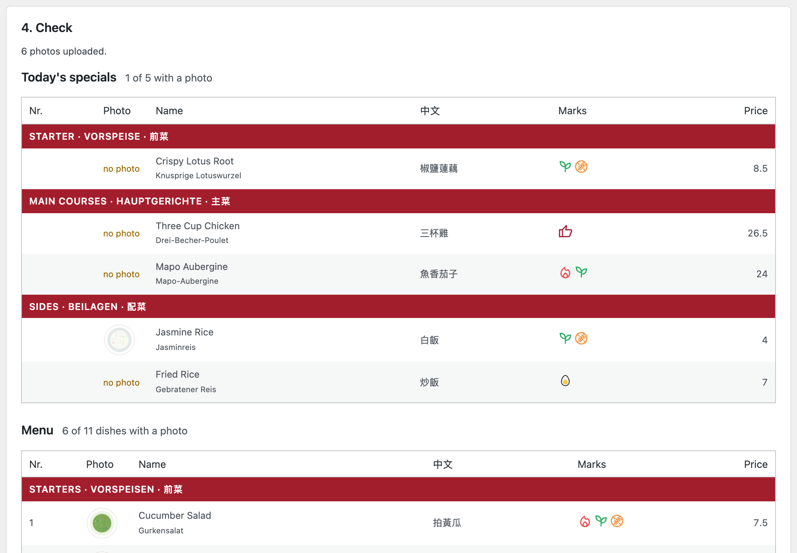
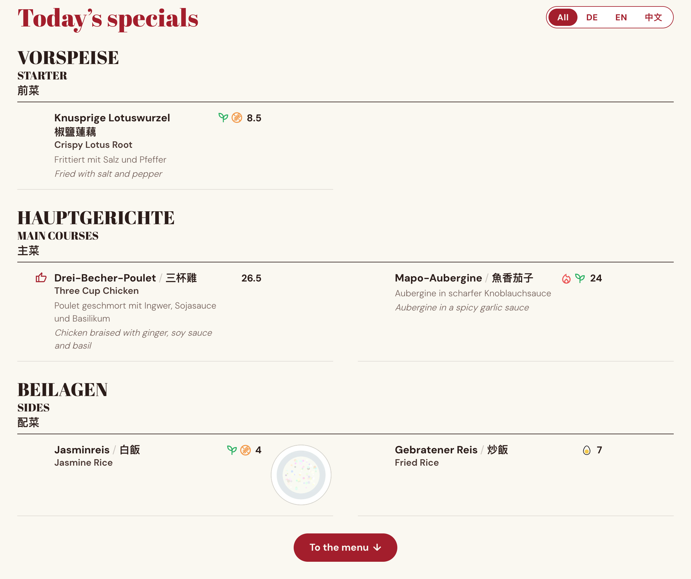
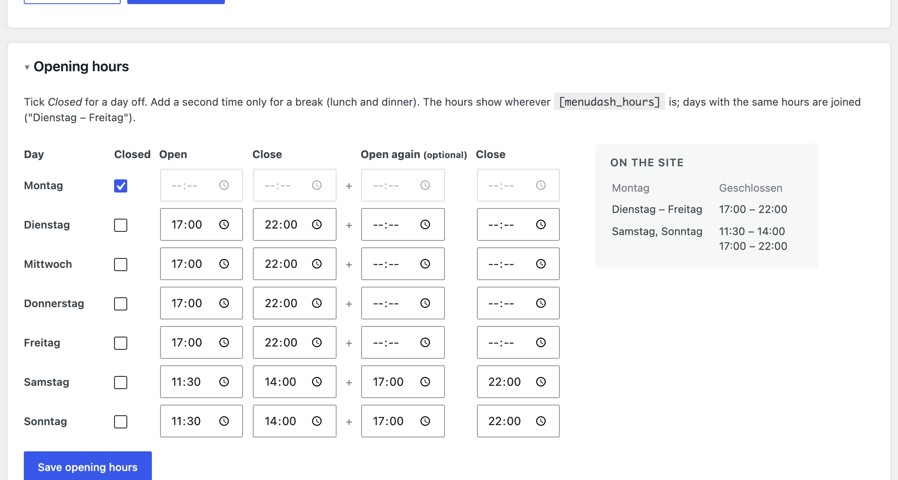

# MenuDash

A restaurant menu for a WordPress site, kept in a spreadsheet. The restaurant uploads its menu as a **CSV file** and its **dish photos** in the dashboard, and the menu page updates by itself. Guests read the menu in **German, English and Chinese**, all at once or one at a time, and **filter by diet**.

| Phone | Desktop |
|---|---|
|  |  |

*Screenshots show the sample menu and the drawn placeholder photos in `sample/`.*

## What guests get

- **Languages:** all three languages at once, or one at a time, via **All · DE · EN · 中文**. The choice is remembered, and `?lang=de` links straight to one language.
- **Diet filters:** Recommended, Vegetarian (includes vegan), Vegan, Gluten-free, Spicy and Not spicy. Filters combine (Spicy and Not spicy switch each other off), and categories with nothing left are hidden.
- **Navigation:** a sticky bar with the filters and the category tabs. It sits under the theme's own fixed header automatically.
- **Photos:** dish photos next to each dish; tap one for a large view.
- **Phone layout:** each language gets its own line, and a Chinese name that doesn't fit next to the German one moves to a line of its own.
- **Search and no-JS:** the menu is real HTML in all three languages, so search engines read it and it works without JavaScript.

## What the restaurant does

1. **Keep the menu in a spreadsheet** and export it as CSV. See [the CSV format](#the-csv) below.
2. **Upload it** under **Dashboard → MenuDash**. A report lists the categories and dishes it read, and warns about anything odd, e.g. the same dish twice with different diet marks.
   - A file that isn't a menu is refused, so the live menu never breaks.
   - The last five uploads are kept, with a **Put back** button.
3. **Upload the photos**, all at once. Name each one after the dish number (`22_Dumplings.png`) or the dish name (`Jasmine Rice.png`).
   - Photos are resized to 400 and 800 px, as WebP where the server can.
   - A check list shows every dish with its photo, and which photos matched nothing.
4. **Today's specials:** a second, short CSV with the same columns, e.g. this week's dishes. It shows wherever `[menudash_specials]` is, in the same style and languages as the menu. The last five files are kept with **Put back**; **Remove** takes the specials off the site.
5. **Holidays and closed days:** enter a first and last day (plus an optional "open again" day and a note). A notice in all three languages appears 60 days before, changes while the restaurant is closed ("closed until … · we look forward to welcoming you again from …") and disappears by itself afterwards.
6. **Opening hours:** a row per weekday with a *Closed* tickbox and time pickers, with an optional second time for a break. Days with the same hours are joined ("Dienstag – Freitag"), so nothing has to be typed in a format.
7. **Optionally, use its own diet icons:** an SVG or a transparent PNG per mark, with **Back to default** to undo.
   - SVGs are cleaned to plain shapes: scripts, event handlers, links, embedded HTML, external images and DOCTYPE/entity tricks are all removed or refused. `dev/svg-test.php` covers this.

| Dashboard → MenuDash | The check after an upload |
|---|---|
|  |  |

| Today's specials | Holiday notice and opening hours |
|---|---|
|  |   |

A step-by-step guide for restaurant staff is in [docs/GUIDE.md](docs/GUIDE.md). It has a screenshot for every step.

## Install

1. Build the zip with `dev/build-zip.sh`, or download it from Releases.
2. In WordPress: **Plugins → Add New Plugin → Upload Plugin**, choose `menudash.zip`, then **Activate**.
3. Put a **Shortcode** block with `[menudash]` on a page.
4. Upload a menu under **Dashboard → MenuDash**. `sample/menu-sample.csv` is a good start.

Requirements: WordPress 6.3 or newer, PHP 7.4 or newer.

### Shortcode options

| | |
|---|---|
| `[menudash]` | The menu, opening in the all-languages view. |
| `[menudash lang="de"]` | First-time guests see only German (or `en`, `zh`); they can still switch. |
| `[menudash offset="80"]` | Space above the sticky bar in pixels, instead of measuring the theme's header. |
| `[menudash_specials]` | Today's specials, with their own language switch. Nothing when none are uploaded. |
| `[menudash_specials switch="no" jump="#menu"]` | Without the switch (e.g. above `[menudash]`, whose switch then changes both), with a "To the menu" button that links to `#menu`. `title="…"` sets the heading, `title=""` leaves it out. |
| `[menudash_closed]` | The holiday notice. `days="30"` shows it 30 days ahead instead of 60. Nothing when no closed day is coming up. |
| `[menudash_hours]` | The opening hours as a table (`lang="en"` or `zh` for the day names). It carries the hours as `data-hours` JSON, e.g. for an "open now" badge in a theme. |

## The CSV

One header row. Columns are found by their **title**, so their order doesn't matter, and extra columns are ignored.

| Column | Also accepted | What it holds |
|---|---|---|
| `No.` | `Nr.`, `Number` | Dish number (optional) |
| `Price` | `Preis` | `8.5`, `18,50`, `18.–`, `CHF 12` … Shown as `8.5`, `12`. |
| `Measure` | `Menge`, `Unit` | Optional, shown under the price |
| `Name (EN)`, `Name (DE)`, `Name (ZH)` | `Name`, `Chinese Name` … | The dish name. A portion after ` - ` is set smaller: `Dumplings - 6 pcs.` |
| `Description (EN)`, `Description (DE)`, `Description (ZH)` | `Beschreibung` … | Optional |
| `Recommended`, `Spicy`, `Vegan`, `Vegetarian`, `Gluten Free` | `Empfohlen`, `Scharf`, `Vegetarisch`, `Glutenfrei` | Any text (usually `X`) means yes |
| `Photo` | `Foto`, `Image` | Optional: a photo file name, to pick the photo by hand |

**How rows are read:**
- **Category heading:** a row with a name but no number and no price. Text in brackets becomes a note: `NOODLES (Hand-pulled every day)`.
- **Dish:** every other row with a name.
- **Missing translations:** a missing name or description falls back to another language.

**File formats:** UTF-8 (with or without BOM), Windows-1252 and MacRoman all work, with commas, semicolons or tabs. Use UTF-8 to keep the Chinese.

## Customise

**Colours and fonts** are CSS custom properties on `.menudash`. Set them in *Appearance → Customize → Additional CSS*:

```css
.menudash {
  --mdash-accent: #1d4ed8;   /* buttons and chips (default a dark red) */
  --mdash-bg: #ffffff;       /* page background (default cream) */
  --mdash-ink: #111827;      /* text, headings, numbers */
  --mdash-muted: #6b7280;    /* descriptions */
  --mdash-display: Georgia, serif;  /* category headings */
  --mdash-sans: system-ui, sans-serif;
}
```

**Texts on the page:** the footer's currency, the allergy note, the button labels and the holiday sentences are in three languages. Change them with the `menudash_strings` filter:

```php
add_filter( 'menudash_strings', function ( $s ) {
	$s['prices'] = array( 'de' => 'Alle Preise in EUR.', 'en' => 'All prices in EUR.', 'zh' => '價格以歐元計。' );
	return $s;
} );
```

## Develop

Everything runs in [WordPress Playground](https://wordpress.github.io/wordpress-playground/), so you only need Node. No PHP, database or server to install.

```sh
dev/serve.sh        # WordPress with MenuDash and the sample menu: http://127.0.0.1:9400/?pagename=menu
dev/test.sh         # CSV parser, photo matching and SVG icon safety tests (dev/test.sh 7.4 for PHP 7.4)
npx @wp-playground/cli php --php=7.4 --mount="$PWD:/repo" -- /repo/dev/lint.php   # syntax check
dev/build-zip.sh    # dist/menudash.zip
```

Layout:
- `menudash/` is the plugin.
- `menudash/includes/csv-parser.php` is plain PHP without WordPress, so the tests run it on its own.
- `menudash/templates/menu.php` renders the page; `section.php` is one category, shared by the menu and the specials.
- `menudash/includes/specials.php`, `closed.php` and `hours.php` are today's specials, the holiday notice and the opening hours.
- `menudash/assets/` holds the front end and the admin page.

## Limits

- **Languages:** German, English and Chinese (Traditional) are built in, with German first. Other languages would need changes to the template.
- **One menu per site**, one set of specials and one set of opening hours.
- **Opening hours** are one week that repeats; a single different day is entered as a holiday.

## License

GPL-2.0-or-later. See [LICENSE](LICENSE).

**Credits:**
- **DM Sans** and **Abril Fatface** fonts, under the SIL Open Font License. Licence files are in `menudash/assets/fonts/`.
- **Default diet icons:** four are adapted from Google Material Symbols (recommended, spicy, vegetarian, vegan), under the Apache License 2.0. See `menudash/assets/ICONS-LICENSE.txt`. The gluten-free icon was drawn by insdash. Any icon can be replaced under *MenuDash → Diet icons*.
