# MenuDash

A restaurant menu for a WordPress site, kept in a spreadsheet. The restaurant uploads its menu as a **CSV file** and its **dish photos** in the dashboard, and the menu page updates by itself. Guests read the menu in **German, English and Chinese**, all at once or one at a time, and **filter by diet**.

The **colours** and **diet icons** are chosen on the same dashboard page, so the menu matches the restaurant.

**Add-ons** (sold separately, see [below](#add-ons)) keep the rest of what guests check on a restaurant's site up to date from the same page: restaurant details and opening hours with an "open now" badge, a holiday notice, today's specials and the lunch menu of the week, and gift card orders by e-mail.

| Phone | Desktop |
|---|---|
| 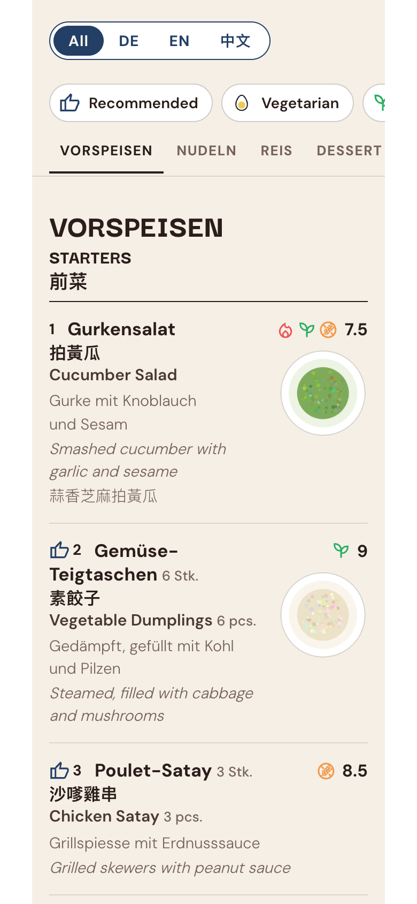 | 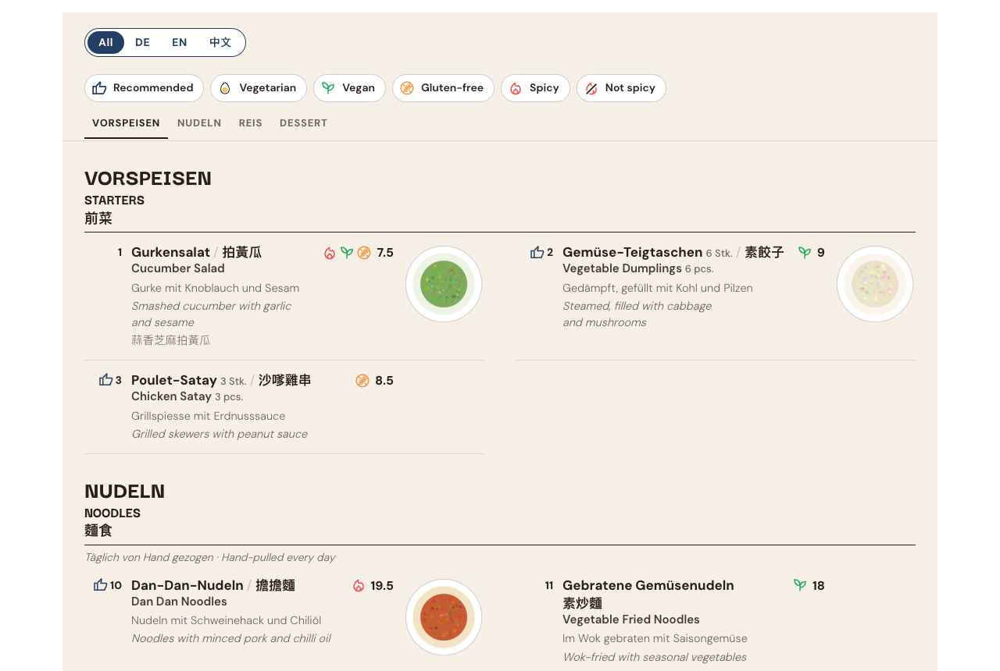 |

*Screenshots show the sample menu and the drawn placeholder photos in `sample/`.*

## What guests get

- **Languages:** all three languages at once, or one at a time, via **All · DE · EN · 中文**. The choice is remembered, and `?lang=de` links straight to one language.
- **Diet filters:** Recommended, Vegetarian (includes vegan), Vegan, Gluten-free, Spicy and Not spicy. Filters combine (Spicy and Not spicy switch each other off), and categories with nothing left are hidden.
- **Navigation:** a sticky bar with the filters and the category tabs. It sits under the theme's own fixed header automatically.
- **Photos:** dish photos next to each dish; tap one for a large view.
- **Phone layout:** each language gets its own line, and a Chinese name that doesn't fit next to the German one moves to a line of its own.
- **Search and no-JS:** the menu is real HTML in all three languages, so search engines read it and it works without JavaScript.

## What the restaurant does

1. **Keep the menu in a spreadsheet** and export it as CSV. See [the CSV format](#the-csv) below.
2. **Upload it** under **Dashboard → MenuDash**. A report lists the categories and dishes it read, and warns about anything odd, e.g. the same dish twice with different diet marks.
   - A file that isn't a menu is refused, so the live menu never breaks.
   - The last five uploads are kept, with a **Put back** button.
3. **Upload the photos**, all at once. Name each one after the dish number (`22_Dumplings.png`) or the dish name (`Jasmine Rice.png`).
   - Photos are resized to 400 and 800 px, as WebP where the server can.
   - A check list shows every dish with its photo, and which photos matched nothing.
4. **Colours:** the theme's own colours by default, so the menu matches the site (only readable ones: a highlight that stands out from the background), or the owner's own background and highlight colour, chosen with colour pickers and a live preview (dark blue on beige to start with). The own colours stay saved when switching back to the theme's. Text on the highlight turns dark by itself when the colour is light.
5. **Fonts:** the theme's text and heading fonts by default (block themes; they follow changes in the Site Editor), or MenuDash's own: DM Sans and Darker Grotesque, bundled.
6. **Optionally, use its own diet icons:** an SVG or a transparent PNG per mark, with **Back to default** to undo.
   - SVGs are cleaned to plain shapes: scripts, event handlers, links, embedded HTML, external images and DOCTYPE/entity tricks are all removed or refused. `dev/svg-test.php` covers this.

7. **Meat and fish origin:** a short list (product + countries, or "please ask our staff"), as Swiss restaurants must give in writing. Products and about 50 countries are translated into the three menu languages; it shows under the menu and anywhere with `[menudash_origin]` (`lang="de|en|zh"`, `title="no"`, `allergy="yes"`).
8. **Several boxes on one page:** with the Specials add-on's lunch menu and specials above the menu, MenuDash adds a row of jump buttons (with one language switch) above the first box, and a back-to-top button while the guest reads the long menu (above a theme's fixed bottom bar, if there is one).
9. **QR code and table cards:** a QR code to the menu page, printed as four A6 table cards on an A4 sheet or as one A4 poster, with the logo, a heading and a tip in the chosen menu languages (built in, or the owner's own), the web address, an optional message and, when filled in, the Wi-Fi name and password with a Wi-Fi code phones join by scanning (the card's own words in the chosen menu languages). The code alone downloads as SVG or PNG. The codes are drawn in the browser (bundled [qrcode-generator](https://github.com/kazuhikoarase/qrcode-generator), MIT), so no outside service is involved.
10. **Recommended dishes** anywhere on the site, e.g. the home page: the block **Recommended dishes** (inserter category *MenuDash*), or `[menudash_picks]` in a classic theme. Each dish shows its photo, number and name and links to it on the menu. In the block's sidebar the owner picks the dishes marked *Recommended* in the spreadsheet, or chooses dishes by number or name (with up/down to order them). **Split into groups** shows them as tabs (one group at a time), as tabs that slide (all groups in one sliding row: a tab slides to its group, swiping moves the tab) or under headings: the Recommended ones split by diet (*Meat & fish* / *Vegan & vegetarian*), or the owner's own groups, each with its own title and dishes. A grid or one sliding row, the language, number, a Vegan/Vegetarian mark, second name and a button to the whole menu are options too. The pictures are always the dishes' photos, so a new photo shows everywhere at once, and a chosen dish is found again after a new menu upload even when its number changed.

The dashboard follows each user's WordPress language (*Profile → Language*): English, German or Traditional Chinese, like the menu itself. The dashboard page **MenuDash** has three tabs, each also in the sidebar: **Menu** (menu CSV, photos, check), **QR code** (QR code, table cards) and **Colours, fonts & icons**. Add-ons add their own tabs.

| Dashboard → MenuDash | The check after an upload |
|---|---|
| 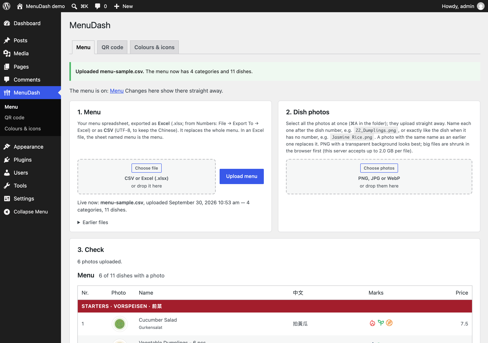 | 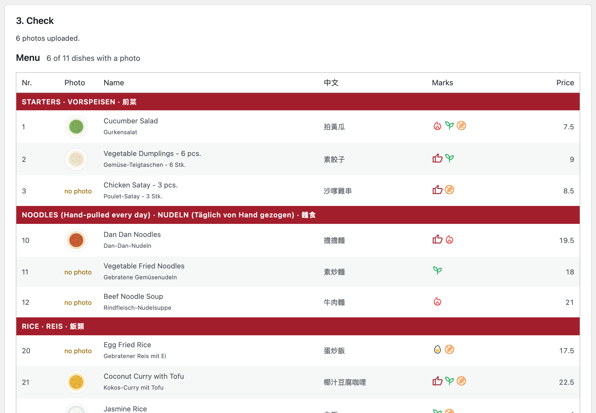 |

| QR code and table cards | Meat and fish origin |
|---|---|
| 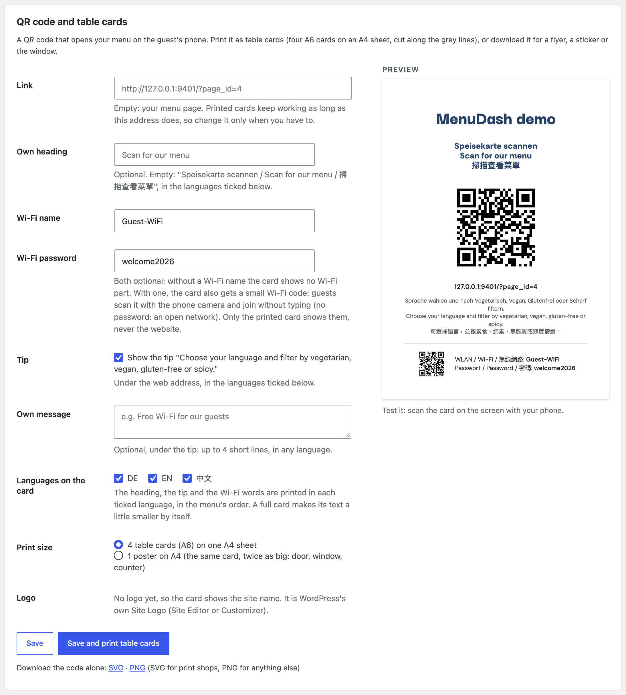 | 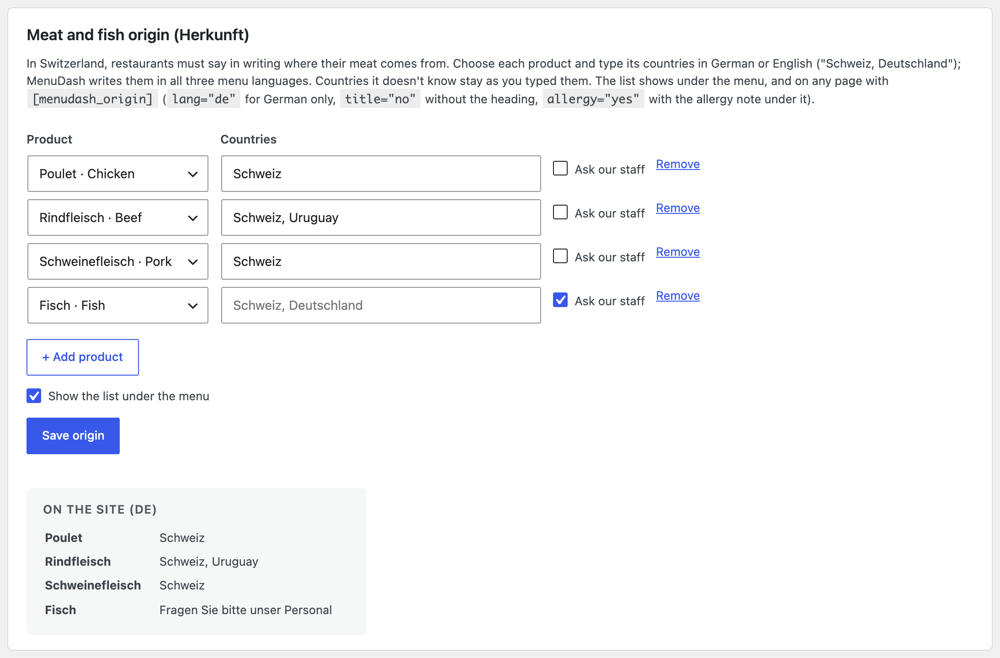 |

| Excel upload | Under the menu |
|---|---|
| 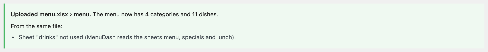 | 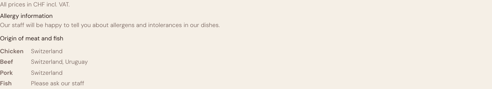 |

| Recommended dishes block | |
|---|---|
| 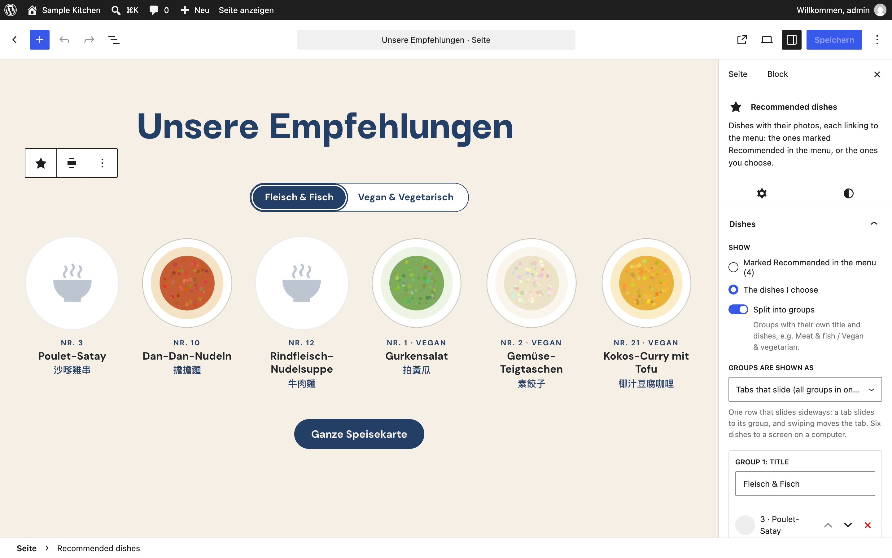 | |

| Colours | |
|---|---|
| 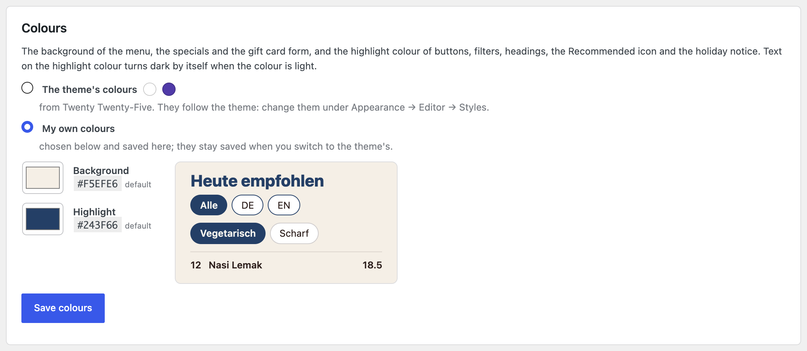 | 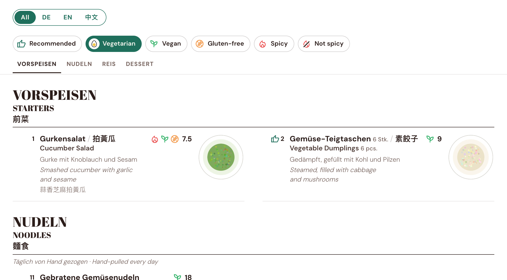 |

A step-by-step guide for restaurant staff is in [docs/GUIDE.md](docs/GUIDE.md). It has a screenshot for every step.

## Install

1. **Download [menudash.zip](https://github.com/yingshiuan/menudash/releases/latest/download/menudash.zip)** from the latest release (also listed under [Releases](https://github.com/yingshiuan/menudash/releases)). Don't use GitHub's green **Code → Download ZIP** button: that is the whole repository (docs, sample, dev scripts), not an installable plugin. Developers can also build the zip themselves with `dev/build-zip.sh`.
2. In WordPress: **Plugins → Add New Plugin → Upload Plugin**, choose `menudash.zip`, then **Activate**. From 2.2.0 on, new releases show up under **Dashboard → Updates** like any other plugin: one click to update, or turn on auto-updates. (WordPress asks this repo's latest GitHub Release twice a day; switch it off with `add_filter( 'menudash_github_updates', '__return_false' );`.) Coming from 2.1.x or older, upload the new zip once and choose **Replace current with uploaded**. The menu, photos and settings always stay.
3. Put a **Shortcode** block with `[menudash]` on a page.
4. Upload a menu under **Dashboard → MenuDash**. `sample/menu-sample.csv` is a good start.

Requirements: WordPress 6.3 or newer, PHP 7.4 or newer.

### Shortcode options

| | |
|---|---|
| `[menudash]` | The menu, opening in the all-languages view. |
| `[menudash lang="de"]` | First-time guests see only German (or `en`, `zh`); they can still switch. |
| `[menudash offset="80"]` | Space above the sticky bar in pixels, instead of measuring the theme's header. |
| `[menudash_picks]` | The dishes marked Recommended, with photos. Options: `dishes="22, 45, Sambal Udang"` (numbers or names, in this order), `max="12"`, `layout="row"`, `lang="de"`, `number="no"`, `second="no"`, `diet="yes"`, `button="no"`, `button_text="…"`. Groups are only in the block. |

## The CSV (or Excel file)

The menu is a CSV file, or an Excel workbook (.xlsx) whose sheet named **menu** holds the same columns (sheets **specials** and **lunch** feed the Specials add-on in the same upload). Numbers files must be exported first (*File → Export To → Excel*). Excel files are read defensively: only the sheet parts, each size-capped; no XML entities; no paths outside the workbook; at most 3,000 rows × 60 columns; formulas are not run (their saved values are used); macro workbooks are refused; the workbook itself isn't stored, only CSV made from its sheets. See `menudash/includes/xlsx.php` and `dev/xlsx-test.php`.

One header row. Columns are found by their **title**, so their order doesn't matter, and extra columns are ignored.

**Example** (the start of [`sample/menu-sample.csv`](sample/menu-sample.csv)):

```csv
No.,Price,Measure,Name (EN),Name (DE),Name (ZH),Description (EN),Description (DE),Description (ZH),Recommended,Spicy,Vegan,Vegetarian,Gluten Free
,,,STARTERS,VORSPEISEN,前菜,,,,,,,,
1,7.5,,Cucumber Salad,Gurkensalat,拍黃瓜,Smashed cucumber with garlic and sesame,Gurke mit Knoblauch und Sesam,蒜香芝麻拍黃瓜,,X,X,,X
2,9,,Vegetable Dumplings - 6 pcs.,Gemüse-Teigtaschen - 6 Stk.,素餃子,"Steamed, filled with cabbage and mushrooms","Gedämpft, gefüllt mit Kohl und Pilzen",,X,,X,,
,,,NOODLES (Hand-pulled every day),NUDELN (Täglich von Hand gezogen),麵食,,,,,,,,
10,19.5,,Dan Dan Noodles,Dan-Dan-Nudeln,擔擔麵,Noodles with minced pork and chilli oil,Nudeln mit Schweinehack und Chiliöl,,X,X,,,
```

Rows 2 and 5 are category headings, and the others are dishes. The whole file is [`sample/menu-sample.csv`](sample/menu-sample.csv). GitHub shows them as a table; use **Download raw file** to get a copy to start from.

| Column | Also accepted | What it holds |
|---|---|---|
| `No.` | `Nr.`, `Number` | Dish number (optional) |
| `Price` | `Preis` | `8.5`, `18,50`, `18.–`, `CHF 12` … Shown as `8.5`, `12`. |
| `Measure` | `Menge`, `Unit` | Optional, shown under the price |
| `Name (EN)`, `Name (DE)`, `Name (ZH)` | `Name`, `Chinese Name` … | The dish name. A portion after ` - ` is set smaller: `Dumplings - 6 pcs.` |
| `Description (EN)`, `Description (DE)`, `Description (ZH)` | `Beschreibung` … | Optional |
| `Recommended`, `Spicy`, `Vegan`, `Vegetarian`, `Gluten Free` | `Empfohlen`, `Scharf`, `Vegetarisch`, `Glutenfrei` | Any text (usually `X`) means yes |
| `Photo` | `Foto`, `Image` | Optional: a photo file name, to pick the photo by hand |

**How rows are read:**
- **Category heading:** a row with a name but no number and no price. Text in brackets becomes a note: `NOODLES (Hand-pulled every day)`.
- **Dish:** every other row with a name.
- **Missing translations:** a missing name or description falls back to another language.

**File formats:** UTF-8 (with or without BOM), Windows-1252 and MacRoman all work, with commas, semicolons or tabs. Use UTF-8 to keep the Chinese.

## Customise

**Colours:** the background and highlight colours are chosen under **Dashboard → MenuDash → Colours**. The other colours and the fonts are CSS custom properties on `.menudash`; set them in *Appearance → Customize → Additional CSS* (colours chosen on the MenuDash page win over `--mdash-bg` and `--mdash-accent` set here):

```css
.menudash {
  --mdash-accent: #1d4ed8;   /* buttons and chips (default a dark red) */
  --mdash-bg: #ffffff;       /* page background (default cream) */
  --mdash-ink: #111827;      /* text, headings, numbers */
  --mdash-muted: #6b7280;    /* descriptions */
  --mdash-display: Georgia, serif;  /* category headings */
  --mdash-sans: system-ui, sans-serif;
}
```

**Texts on the page:** the footer's currency, the allergy note and the button labels are in three languages (the add-ons' texts too). The QR card's own words are `qr_title`, `qr_tip`, `wifi` and `password`. The allergy note is `allergy_title` plus `allergy`, or `allergy_phone` (with `%s` for the phone number, a tap-to-call link) when MenuDash Restaurant has a phone number. Change them with the `menudash_strings` filter:

```php
add_filter( 'menudash_strings', function ( $s ) {
	$s['prices'] = array( 'de' => 'Alle Preise in EUR.', 'en' => 'All prices in EUR.', 'zh' => '價格以歐元計。' );
	return $s;
} );
```

## Develop

Everything runs in [WordPress Playground](https://wordpress.github.io/wordpress-playground/), so you only need Node. No PHP, database or server to install.

```sh
dev/serve.sh        # WordPress with MenuDash and the sample menu: http://127.0.0.1:9400/?pagename=menu
dev/test.sh         # CSV parser, photo matching and SVG icon safety tests (dev/test.sh 7.4 for PHP 7.4)
npx @wp-playground/cli php --php=7.4 --mount="$PWD:/repo" -- /repo/dev/lint.php   # syntax check
dev/build-zip.sh    # dist/menudash.zip
```

Layout:
- `menudash/` is the plugin.
- `menudash/includes/csv-parser.php` is plain PHP without WordPress, so the tests run it on its own.
- `menudash/templates/menu.php` renders the page; `section.php` is one category (add-ons reuse it).
- `menudash/assets/` holds the front end and the admin page.

## Limits

- **Languages:** German, English and Chinese (Traditional) are built in, with German first. Other languages would need changes to the template.
- **One menu per site.**

## Add-ons

Three add-on plugins build on MenuDash. Each adds its own tab to the MenuDash page and works on its own; install only what the restaurant needs.

| Add-on | What it adds |
|---|---|
| **MenuDash Restaurant** | Restaurant details entered once (address, phone, e-mail, getting here, delivery and reservation links, social links); opening hours with time pickers; a holiday notice that appears and disappears by itself; an "open now" badge; blocks for block themes (Open now, Opening hours, Contact, Reserve / Order / Call / Directions buttons); the data Google shows about the restaurant. |
| **MenuDash Specials** | Today's specials and the lunch menu of the week (today's lunch, or the whole week), each from its own short CSV, in the same style and languages as the menu. |
| **MenuDash Gift Cards** | A gift card order form: guests choose amounts, pickup or post, and the order arrives by e-mail. Pause switch, test e-mail, spam protection (optionally with Cloudflare Turnstile). |

The add-ons are not in this repository. They are set up for restaurants by **insdash**, together with MenuDash and, if wanted, the free [MenuDash Theme](https://github.com/yingshiuan/menudash-theme). Contact: [insdash.ch](https://insdash.ch).

Without an add-on, its shortcodes (e.g. `[menudash_specials]` in a theme) show nothing, so a theme made for all of them still works with MenuDash alone.

## License

GPL-2.0-or-later. See [LICENSE](LICENSE).

**Credits:**
- **DM Sans** and **Darker Grotesque** fonts (the same as MenuDash Theme), under the SIL Open Font License. Licence files are in `menudash/assets/fonts/`.
- **QR codes:** `menudash/assets/vendor/qrcode.js` is qrcode-generator 1.4.4 by Kazuhiko Arase, under the MIT license (in the file's header).
- **Default diet icons:** four are adapted from Google Material Symbols (recommended, spicy, vegetarian, vegan), under the Apache License 2.0. See `menudash/assets/ICONS-LICENSE.txt`. The gluten-free icon was drawn by insdash. Any icon can be replaced under *MenuDash → Diet icons*.
