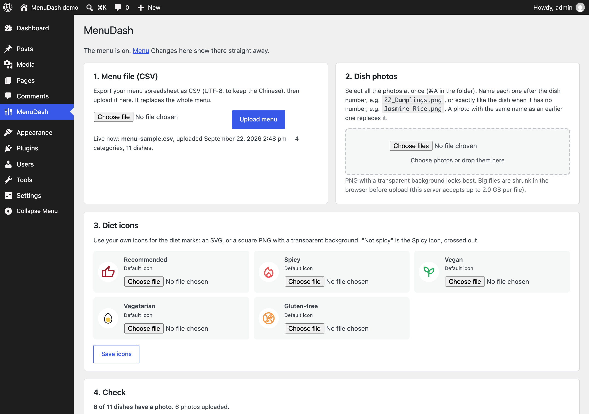
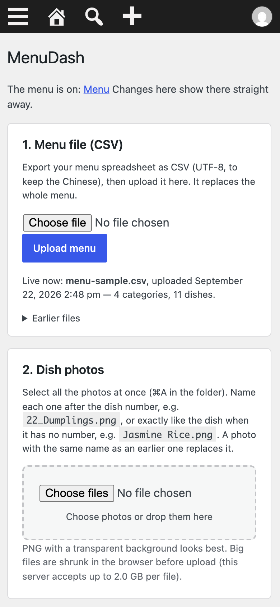
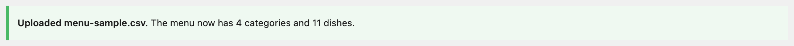
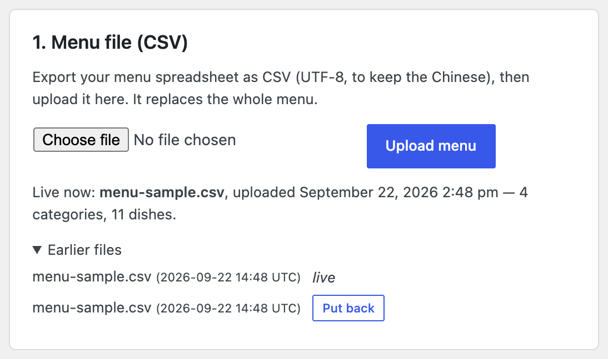
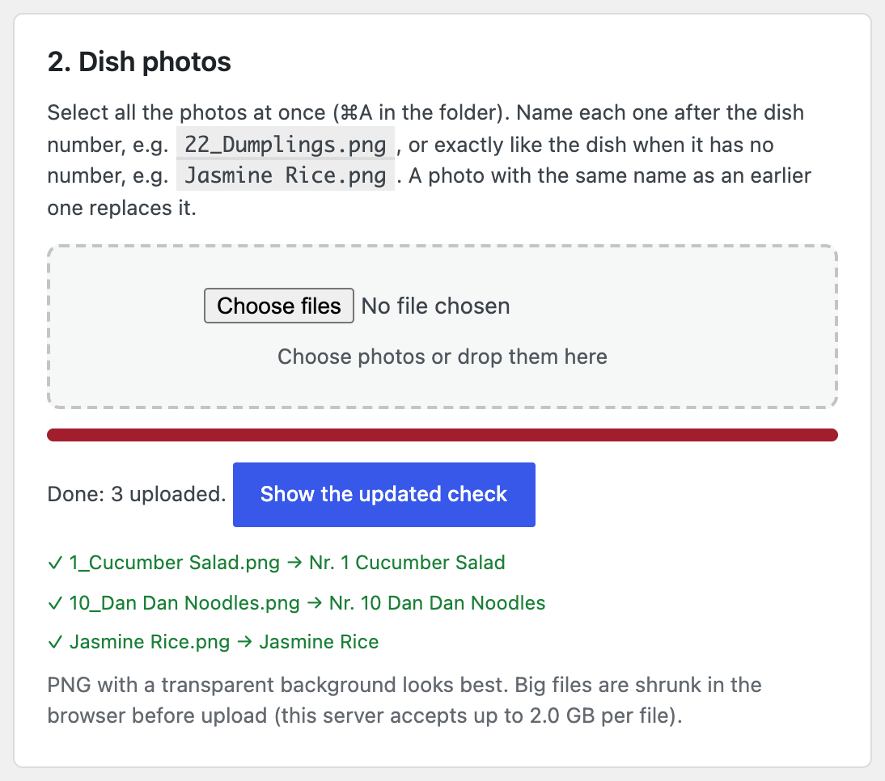
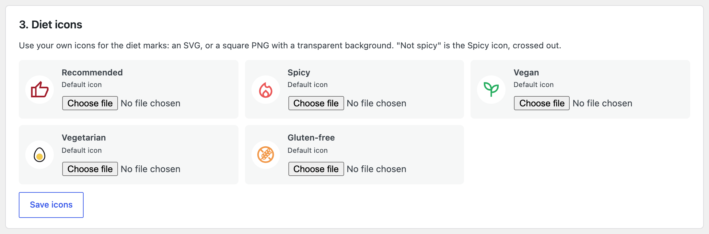
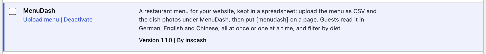
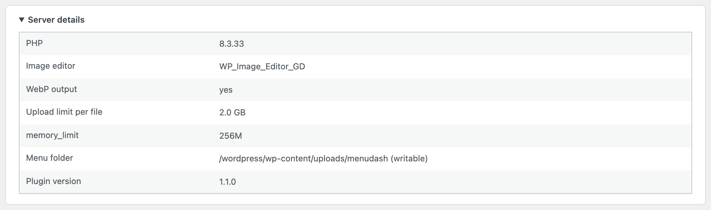

# MenuDash: keeping the menu up to date

The menu page builds itself from two things you upload: **the menu spreadsheet as a CSV file** and **the dish photos**. You never edit the page itself. Everything happens in the WordPress dashboard under **MenuDash** (the fork-and-knife icon in the left bar).

 

---

## Changing the menu (prices, dishes, texts)

1. Make the change in your menu spreadsheet (Numbers, Excel, Google Sheets…).
2. Export it as CSV:
   - **Numbers:** *File → Export To → CSV…*, with *Text Encoding* on **Unicode (UTF-8)**.
   - **Excel:** *Save As → CSV UTF-8*.
   - **Google Sheets:** *File → Download → Comma-separated values*.

   UTF-8 keeps the Chinese.
3. In WordPress: **MenuDash → 1. Menu file → Choose file → Upload menu**.

The menu page changes right away, and a message says how many categories and dishes were read:

- **Green:** everything is fine.
- **Yellow:** the menu was updated, but something looks odd (see *Messages* below).
- **Red:** the file was not used. The old menu stays online, so a wrong file can never break the page.

**Undo:** open *Earlier files* under the upload button and click **Put back** next to an older upload. The last five uploads are kept.

### How the spreadsheet is read

- **Category heading:** a row with a name but no **No.** and no **Price** (e.g. `STARTERS | VORSPEISEN | 前菜`). Text in brackets becomes a small note under the heading: `NOODLES (Hand-pulled every day)`.
- **Dish:** any row with a name and a price or a number. The number may be empty.
- **Diet marks:** any text in *Recommended*, *Spicy*, *Vegan*, *Vegetarian*, *Gluten Free* counts as "yes", usually `X`. Vegan dishes don't need the vegetarian mark too; the *Vegetarian* filter includes them.
- **Portion:** text after ` - ` in a name, like `Vegetable Dumplings - 6 pcs.`, is shown smaller after the name.
- **Missing translations:** if a name or description is empty in one language, guests see another one instead.
- **Columns:** found by their title, so their order doesn't matter. German titles (*Nr.*, *Preis*, *Glutenfrei*…) work too.
- **Optional columns:**
  - **Photo:** a photo file name, to choose the photo for that dish by hand.
  - **Measure:** shown under the price (e.g. `100 g`).

`sample/menu-sample.csv` shows all of this in a small menu.

### Messages you may see

- **"… is listed twice with different marks":** the same dish appears in two places with different diet marks. One of them is probably wrong.
- **"The file was saved as Windows-1252, not UTF-8":** export again as UTF-8 to keep the Chinese names.
- **"This does not look like the menu file":** a different CSV was picked. Nothing was changed.
- **"Nr. X is used twice":** two dishes share a number. Both are shown, but a photo named with that number goes to the first one.

---

## Photos

In **MenuDash → 2. Dish photos**, click **Choose photos**, select all the photos in the folder (**⌘A** / **Ctrl+A**) and confirm, or drag them onto the box. They upload one by one, and the list shows which dish each photo went to.

**How to name a photo:**
- **The dish number first:** `22_Vegetable Dumplings.png`. Everything after the number is only for you.
- **Dishes without a number:** the exact dish name, e.g. `Jasmine Rice.png`.
- **Exception:** if the name after the number is exactly another dish's name, the name wins, because the number is probably from an old menu.

**Replacing a photo:** upload one with the same name. Only the name counts, not the ending: `22_Dumplings.jpg` replaces `22_Dumplings.png`.

**What looks best:** PNG cut-outs with a transparent background sit best on the page. Normal square photos (JPG) are cut into a circle automatically.

**File size doesn't matter:** big photos are shrunk before upload and again on the server. The page loads small copies.

### 4. Check

Below the uploads is a list of every dish with its photo, or **"no photo"**, plus its marks and price. **Photos not shown** lists photos that are not on the menu, either because they match no dish or because a newer photo fits the same dish. Rename and upload them again, or delete them.

---

## Diet icons

The five marks (Recommended, Spicy, Vegan, Vegetarian, Gluten-free) come with icons. To use your own, go to **MenuDash → 3. Diet icons**, choose a file next to the mark, and click **Save icons**. "Not spicy" uses the Spicy icon, crossed out.

- **Best:** an **SVG**. It stays sharp at any size and keeps its colours. For safety, only the drawing is kept; anything else in the file (scripts, links, embedded pictures) is removed. If the colours disappear, export the SVG again with "presentation attributes" instead of CSS classes.
- **Also fine:** a square **PNG** (or WebP/JPEG) with a transparent background. It is shrunk to icon size automatically.
- **Undo:** **Back to default** puts the original icon back.

Your icons are kept when the plugin is updated or reinstalled.

---

## Setting it up (once)

1. **Plugins → Add New Plugin → Upload Plugin** → choose `menudash.zip` → **Install Now** → **Activate**.
2. On the menu page, add a **Shortcode** block containing `[menudash]`.
3. Upload the CSV and the photos as described above.

**Try it privately first:** put the shortcode on a new **draft** page and open it with *Preview*.

**Updating the plugin:** upload a newer `menudash.zip` the same way; WordPress asks whether to replace the current version. The menu and the photos are kept, even if the plugin is deleted and installed again.

**Server details** at the bottom of the MenuDash page show whether the host supports everything:
- PHP 7.4 or newer.
- An image editor.
- WebP. Without it, photos are stored as PNG/JPG, which also works.

