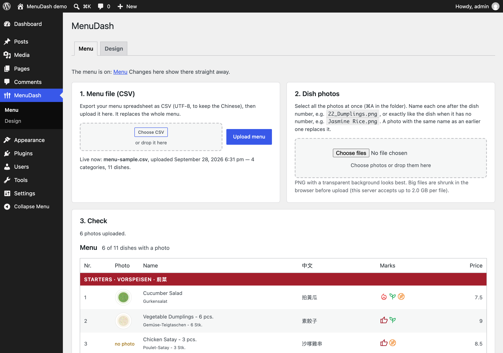
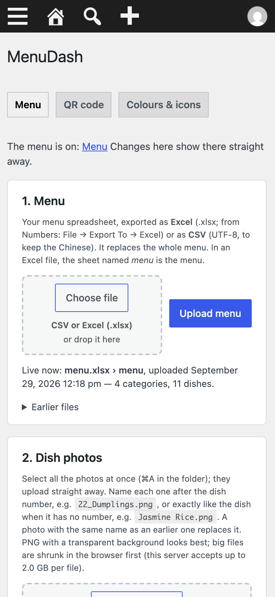
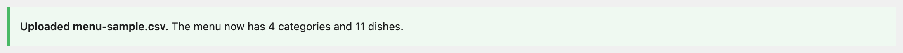
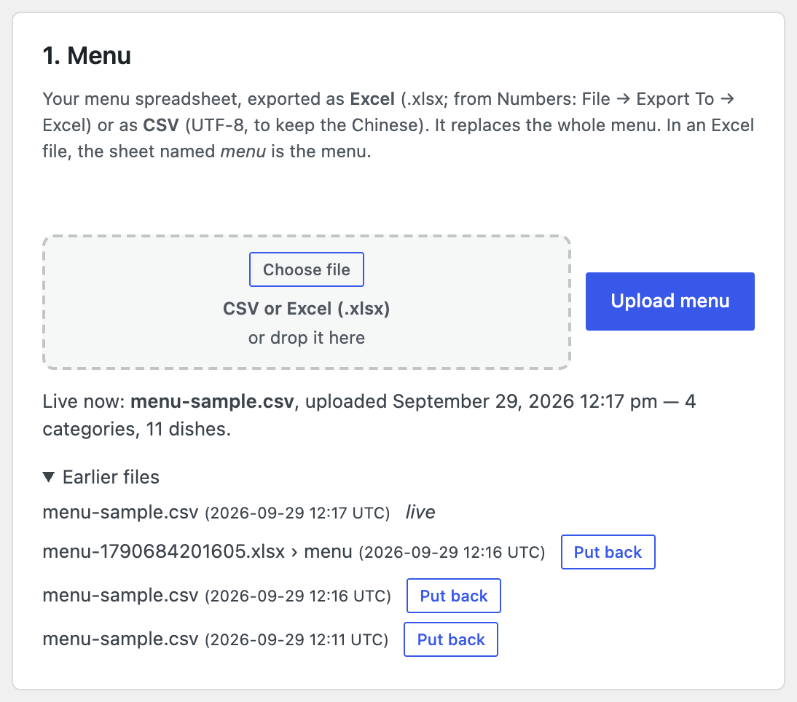
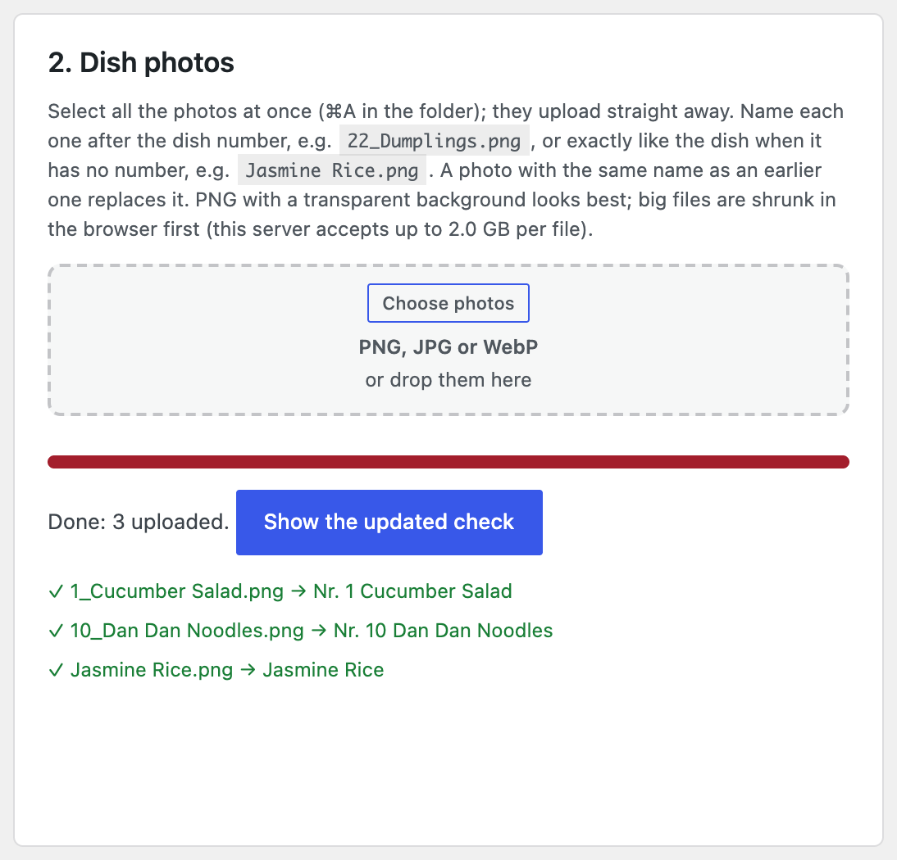
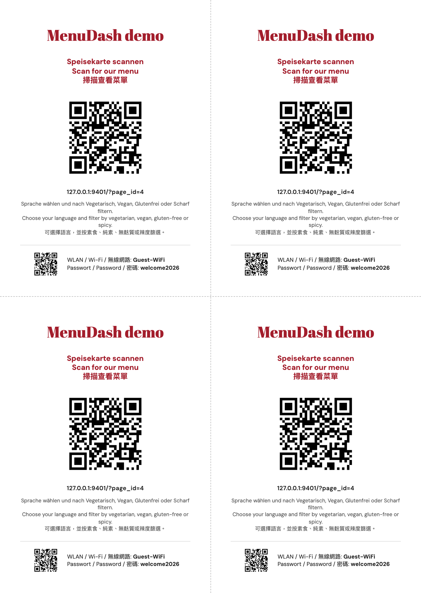
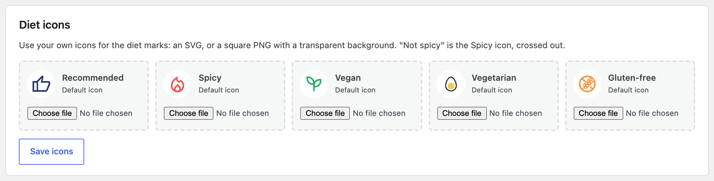
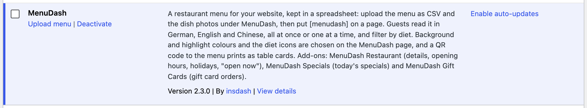
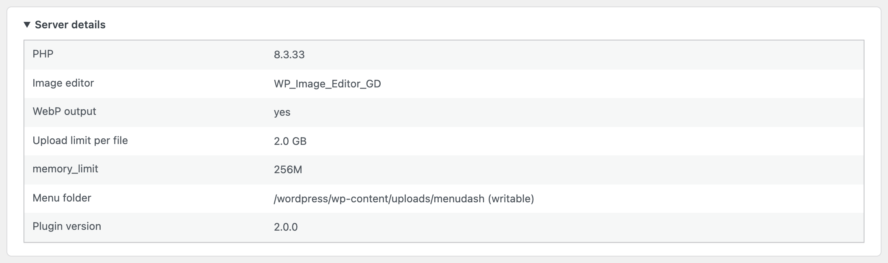

# MenuDash: keeping the menu up to date

The menu page builds itself from two things you upload: **the menu spreadsheet as a CSV file** and **the dish photos**. You never edit the page itself. Everything happens in the WordPress dashboard under **MenuDash** (the fork-and-knife icon in the left bar).

 

The page has three tabs, each also listed in the left bar under MenuDash:

| Tab | What's there |
|---|---|
| **Menu** | 1. menu file, 2. dish photos, 3. the check of every dish and photo |
| **QR code** | QR code, table cards, A4 poster |
| **Colours & icons** | colours, diet icons |

Add-ons (MenuDash Restaurant, Specials, Gift Cards) add their own tabs and boxes; their guide comes with them.

---

## Changing the menu (prices, dishes, texts)

1. Make the change in your menu spreadsheet (Numbers, Excel, Google Sheets…).
2. Export it as **Excel (.xlsx)** or **CSV**:
   - **Numbers:** *File → Export To → Excel…* (all sheets in one file), or *File → Export To → CSV…* with *Text Encoding* on **Unicode (UTF-8)**.
   - **Excel:** save as a normal workbook (.xlsx), or *Save As → CSV UTF-8*.
   - **Google Sheets:** *File → Download → Microsoft Excel (.xlsx)* or *Comma-separated values*.

   For CSV, UTF-8 keeps the Chinese. A Numbers file itself (.numbers) can't be read by a website: export it.
   In an Excel file, the sheet named **menu** is the menu (a workbook with only one sheet: that sheet); with MenuDash Specials, sheets named **specials** and **lunch** update today's specials and the lunch menu in the same upload. Other sheets are listed as not used. A title row above the header (Numbers adds the table's name) is skipped.
3. In WordPress: **MenuDash → Menu → 1. Menu → Choose file → Upload menu**.

The menu page changes right away, and a message says how many categories and dishes were read:

- **Green:** everything is fine.
- **Yellow:** the menu was updated, but something looks odd (see *Messages* below).
- **Red:** the file was not used. The old menu stays online, so a wrong file can never break the page.

With an Excel file, the message lists each sheet:

**Undo:** open *Earlier files* under the upload button and click **Put back** next to an older upload. The last five uploads are kept.

### How the spreadsheet is read

- **Category heading:** a row with a name but no **No.** and no **Price** (e.g. `STARTERS | VORSPEISEN | 前菜`). Text in brackets becomes a small note under the heading: `NOODLES (Hand-pulled every day)`.
- **Dish:** any row with a name and a price or a number. The number may be empty.
- **Diet marks:** any text in *Recommended*, *Spicy*, *Vegan*, *Vegetarian*, *Gluten Free* counts as "yes", usually `X`. Vegan dishes don't need the vegetarian mark too; the *Vegetarian* filter includes them.
- **Portion:** text after ` - ` in a name, like `Vegetable Dumplings - 6 pcs.`, is shown smaller after the name.
- **Missing translations:** if a name or description is empty in one language, guests see another one instead.
- **Columns:** found by their title, so their order doesn't matter. German titles (*Nr.*, *Preis*, *Glutenfrei*…) work too.
- **Optional columns:**
  - **Photo:** a photo file name, to choose the photo for that dish by hand.
  - **Measure:** shown under the price (e.g. `100 g`).

`sample/menu-sample.csv` shows all of this in a small menu.

### Messages you may see

- **"… is listed twice with different marks":** the same dish appears in two places with different diet marks. One of them is probably wrong.
- **"The file was saved as Windows-1252, not UTF-8":** export again as UTF-8 to keep the Chinese names.
- **"This does not look like the menu file":** a different CSV was picked. Nothing was changed.
- **"Nr. X is used twice":** two dishes share a number. Both are shown, but a photo named with that number goes to the first one.

---

## Photos

In **MenuDash → Menu → 2. Dish photos**, click **Choose photos**, select all the photos in the folder (**⌘A** / **Ctrl+A**) and confirm, or drag them onto the box. They upload one by one, and the list shows which dish each photo went to.

**How to name a photo:**
- **The dish number first:** `22_Vegetable Dumplings.png`. Everything after the number is only for you.
- **Dishes without a number:** the exact dish name, e.g. `Jasmine Rice.png`.
- **Exception:** if the name after the number is exactly another dish's name, the name wins, because the number is probably from an old menu.

**Replacing a photo:** upload one with the same name. Only the name counts, not the ending: `22_Dumplings.jpg` replaces `22_Dumplings.png`.

**What looks best:** PNG cut-outs with a transparent background sit best on the page. Normal square photos (JPG) are cut into a circle automatically.

**File size doesn't matter:** big photos are shrunk before upload and again on the server. The page loads small copies.

### 3. Check

Below the uploads is a list of every dish with its photo, or **"no photo"**, plus its marks and price. **Photos not shown** lists photos that are not on the menu, either because they match no dish or because a newer photo fits the same dish. Rename and upload them again, or delete them.

---

## Meat and fish origin

Under **MenuDash → Menu → Meat and fish origin**, list where your meat and fish come from: choose a product (or **Other** and type its name in each language), type the countries in German or English ("Schweiz, Deutschland"), or tick **Ask our staff**. MenuDash translates products and the usual countries into the three menu languages; a country it doesn't know stays as typed. The list shows under the menu (can be switched off) and on any page with `[menudash_origin]` — `lang="de"` for one language, `title="no"` without the heading, `allergy="yes"` with the allergy note under the list.

## QR code and table cards

Under **MenuDash → QR code** is a QR code that opens your menu on the guest's phone, with a preview that changes while you type (scan the screen with your phone to test it).

- **Link:** empty means your menu page. Printed cards keep working as long as that address does.
- **Heading and tip are built in**, in the languages ticked under **Languages on the card**: "Scan for our menu" above the code and "Choose your language and filter by vegetarian, vegan, gluten-free or spicy." under the web address, one line per language. **Own heading** replaces the heading, the **Tip** can be switched off, and **Own message** adds up to 4 short lines. A full card shrinks its text a little by itself.
- **Wi-Fi name and password:** only on the printed card, with a small Wi-Fi code that phones join by scanning; without a name there is no Wi-Fi part.
- **Print size:** four A6 table cards on an A4 sheet (cut along the grey lines) or one A4 poster.
- The logo is WordPress's Site Logo (with MenuDash Restaurant: **Restaurant → Logo and icon**), or the site name when there is none.
- **Save and print table cards** opens the sheet in a new tab; print at 100 % ("Actual size"). **SVG** and **PNG** download the code alone.

## Recommended dishes (home page)

With a block theme, add the block **Recommended dishes** (in the "+" list under *MenuDash*) where you want a row of dishes, e.g. on the home page. Each dish shows its photo, number and name and links to it on the menu. Click the block, and the sidebar offers:

- **Show:** the dishes marked *Recommended* in your spreadsheet (change them there), or **the dishes I choose**: type a number or a name, click *Add*, and order them with the arrows.
- **Split into groups:** *Meat & fish* and *Vegan & vegetarian* by the spreadsheet's diet marks, or your own groups with their own titles. Shown as **tabs**, as **tabs that slide** (one row: a tab slides to its dishes, swiping moves the tab) or under **headings**.
- **Look:** grid or one sliding row, the language, number, a Vegan/Vegetarian mark, the Chinese name, and a button to the whole menu.

The pictures are always the dishes' photos (see [Photos](#photos)): to change one, upload a new photo for that dish. A dish taken off the menu disappears from the row by itself; the editor tells you which. In a classic theme, use `[menudash_picks]` (e.g. `[menudash_picks dishes="22, 45"]`).

## Colours

Under **MenuDash → Colours & icons → Colours**, choose which colours the menu (and the add-ons' boxes) use:

- **The theme's colours** (the default when the theme has suitable ones): the menu matches the site and follows the theme when you change its colours under *Appearance → Editor → Styles*. Only readable colours are taken: a highlight that stands out from the background.
- **My own colours**: pick the **background** and the **highlight** colour of buttons, filters, headings and the Recommended icon. They start as dark blue on beige, and stay saved when you switch to the theme's colours and back.

The preview changes while you pick. Text on the highlight turns dark by itself when the colour is light, and a warning appears if a choice would be hard to read. With a theme that has no suitable colours, **Back to default** returns to dark blue on beige.

---

## Diet icons

The five marks (Recommended, Spicy, Vegan, Vegetarian, Gluten-free) come with icons. To use your own, go to **MenuDash → Colours & icons → Diet icons**, choose a file next to the mark, and click **Save icons**. "Not spicy" uses the Spicy icon, crossed out.

- **Best:** an **SVG**. It stays sharp at any size and keeps its colours. For safety, only the drawing is kept; anything else in the file (scripts, links, embedded pictures) is removed. If the colours disappear, export the SVG again with "presentation attributes" instead of CSS classes.
- **Also fine:** a square **PNG** (or WebP/JPEG) with a transparent background. It is shrunk to icon size automatically.
- **Undo:** **Back to default** puts the original icon back.

Your icons are kept when the plugin is updated or reinstalled.

---

## Setting it up (once)

1. **Plugins → Add New Plugin → Upload Plugin** → choose `menudash.zip` → **Install Now** → **Activate**.
2. On the menu page, add a **Shortcode** block containing `[menudash]`.
3. Upload the CSV and the photos as described above.

**Try it privately first:** put the shortcode on a new **draft** page and open it with *Preview*.

**Updating the plugin:** from version 2.2.0 on, WordPress shows new MenuDash versions under **Dashboard → Updates** and on the Plugins page, like any other plugin: click **Update now**, or **Enable auto-updates** to have it done by itself. Older versions: upload a newer `menudash.zip` the same way; WordPress asks whether to replace the current version. The menu and the photos are kept, even if the plugin is deleted and installed again.

**Server details** at the bottom of the MenuDash page show whether the host supports everything:
- PHP 7.4 or newer.
- An image editor.
- WebP. Without it, photos are stored as PNG/JPG, which also works.

